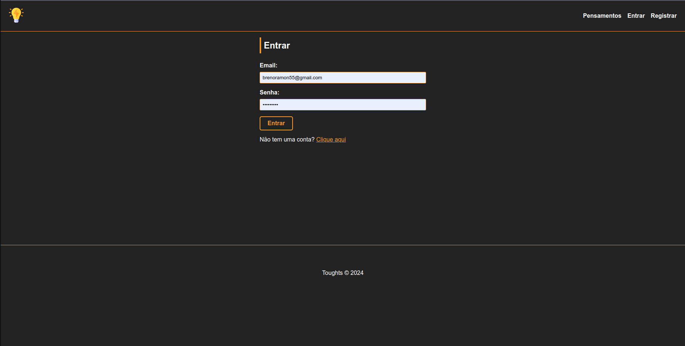

# Node.js Thoughts App

Este é um projeto simples de cadastro de usuários, onde cada usuário pode expor seus pensamentos em um dashboard. O projeto segue o princípio de UI amigável e implementa o CRUD completo (Criar, Ler, Atualizar e Deletar).

## Índice

- [Instalação](#instalação)
- [Tecnologias Usadas](#tecnologias-usadas)
- [Funcionalidades](#funcionalidades)
- [Como Usar](#como-usar)
- [Estrutura de Pastas](#estrutura-de-pastas)
- [Imagens do Projeto](#imagens-do-projeto)
  - [Página de Login](#página-de-login)
  - [Página de Cadastro](#página-de-cadastro)
  - [Dashboard](#dashboard)
  - [CRUD de Pensamentos](#crud-de-pensamentos)
- [Contribuição](#contribuição)
- [Licença](#licença)

---

## Instalação

1. Clone o repositório:
   ```bash
   git clone https://github.com/brenoramon123/Toughts-JS
   ```

2. Instale as dependências:
   ```bash
   npm install
   ```

3. Configure as variáveis de ambiente no arquivo `.env` (baseado no arquivo `.env.example`).

4. Inicie o servidor:
   ```bash
   npm start
   ```

---

## Tecnologias Usadas

- **Node.js**
- **Express.js**
- **MySQL** 
- **Handlebars** 
- **Bootstrap** 

---

## Funcionalidades

- Cadastro e Login de Usuários
- Criação, visualização, edição e exclusão de pensamentos no dashboard
- Validação de formulários
- Autenticação de usuários
- Interface amigável e responsiva

---

## Como Usar

1. Acesse a página de login ou cadastro.
2. Após o login, o usuário será redirecionado para o dashboard, onde poderá ver todos os pensamentos postados.
3. O usuário pode criar um novo pensamento, editar ou excluir seus pensamentos existentes.
4. Apenas usuários logados podem ver e interagir com o dashboard.

---

## Estrutura de Pastas

```bash
├── controllers
│   ├── authController.js
│   └── Toughtscontroller.js
├── db
│   └── conn.js
├── helpers
│   └── auth.js
├── index.js
├── models
│   ├── Tought.js
│   └── User.js
├── package.json
├── package-lock.json
├── public
│   ├── css
│   │   └── styles.css
│   └── img
│       ├── favicon.ico
│       └── toughts_logo.png
├── README.md
├── routes
│   ├── auth.routes.js
│   └── tougths.routes.js
├── sessions
└── views
    ├── auth
    │   ├── login.handlebars
    │   └── register.handlebars
    ├── layouts
    │   └── main.handlebars
    └── toughts
        ├── create.handlebars
        ├── dashboard.handlebars
        ├── edit.handlebars
        └── home.handlebars
```

---

## Imagens do Projeto

### Página de Login



---

### Página de Cadastro


---

### Dashboard


---

### CRUD de Pensamentos

#### Criar Pensamento


#### Editar Pensamento


#### Excluir Pensamento


---

## Contribuição

1. Faça um fork do repositório.
2. Crie uma nova branch com sua feature:
   ```bash
   git checkout -b minha-feature
   ```
3. Commit suas mudanças:
   ```bash
   git commit -m 'Adicionei nova feature'
   ```
4. Faça o push para a branch:
   ```bash
   git push origin minha-feature
   ```
5. Abra um Pull Request.

---

## Licença

Este projeto está sob a licença MIT. Veja o arquivo [LICENSE](LICENSE) para mais detalhes.